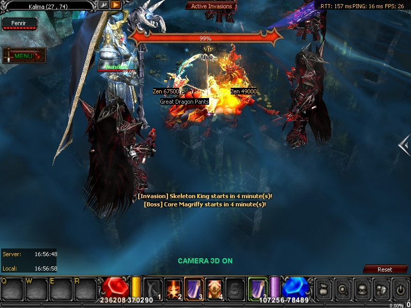

# ▫️ KUNDUN

**KUNDUN**, aparece en el mapa **Kalima**, este mapa no lo encuentras en el listado de la "M" tienes que crear el portal que te transportara a dicho mapa. Como creas el portal, solo necesitas recolectar el Symbol of Kundun, al juntar 5 de estos se convertirá en un pergamino llamado Lost Map, al dropear ese pergamino en una zona pvp se abrirá un portal que te llevara a Kalima.

**Importante:** El mapa kalima tiene 7 niveles, el boss kundun solo sale en el nivel 7 para ello tienes que juntar los symbol of kundun +7.&#x20;

**Drop:** Piedras Brilliant (Mix de Set y Armas), Piedras de mix de Monturas.

<figure><figcaption></figcaption></figure>

Una  ves dentro, tendrás que dirigirte a lo mas profundo del mapa donde encontraras al Kundun, recuerda que ese boss sale cada 4 horas después de ser eliminado así que tendrás que tomar el tiempo de su reaparición.

<figure><figcaption></figcaption></figure>
