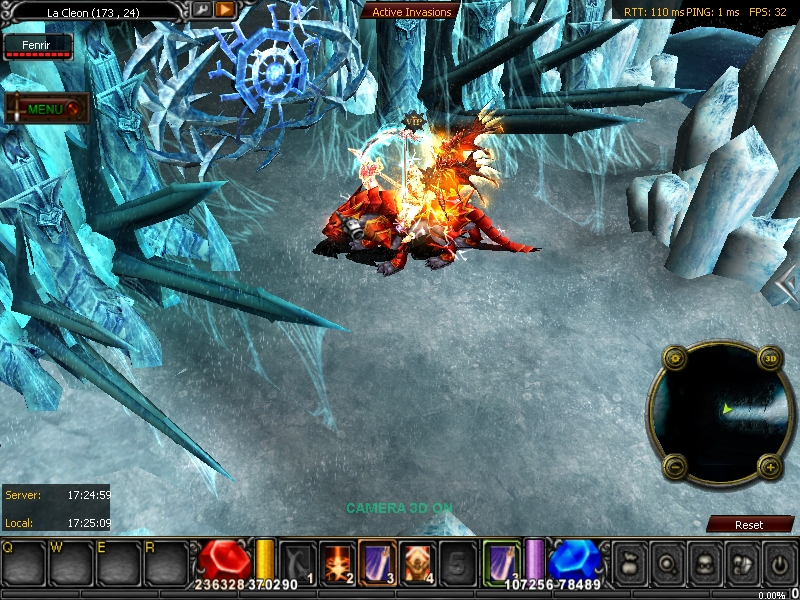
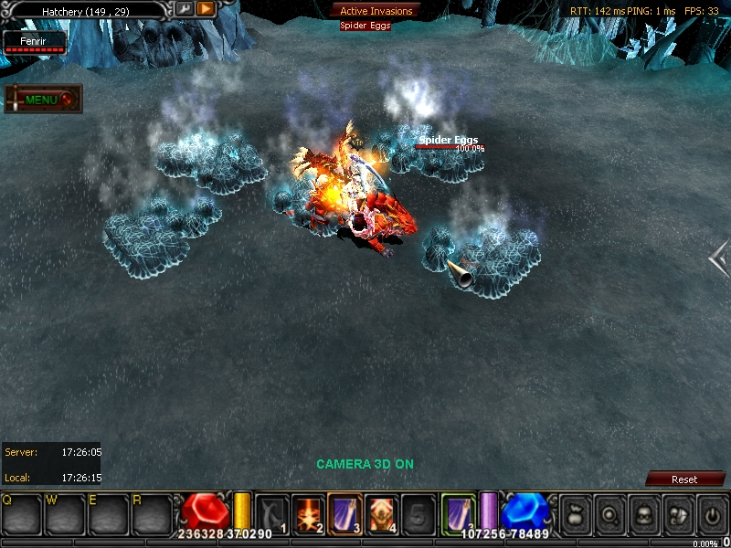
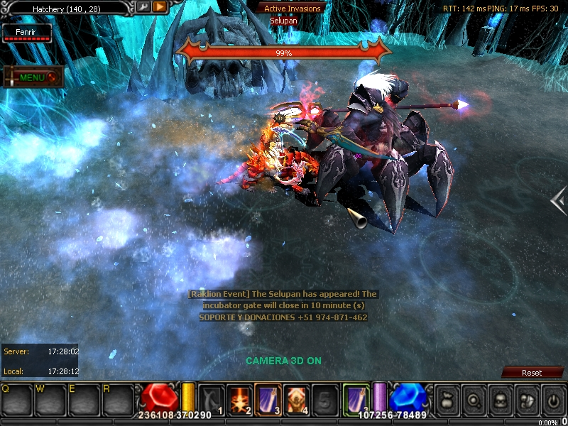

# ▫️ SELUPAN

**SELUPAN**, aparece en el mapa **Lacleon**, para llegar a su posición tendrás que ir a una zona del mapa donde encontraras un portal, dentro del portal tendrás que iniciar matando a sus crías para luego poder invocarlo.

El portal lo encontraras en las coordenadas (173, 24)

**Drop:** Piedras Brilliant (Mix de Set y Armas), Piedras de mix de Monturas.

<figure><figcaption></figcaption></figure>

<figure><figcaption></figcaption></figure>

<figure><figcaption></figcaption></figure>
